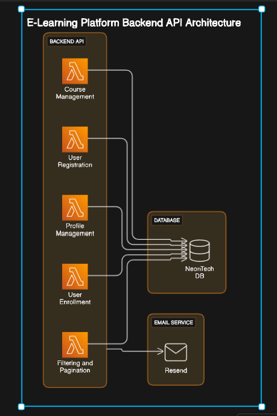
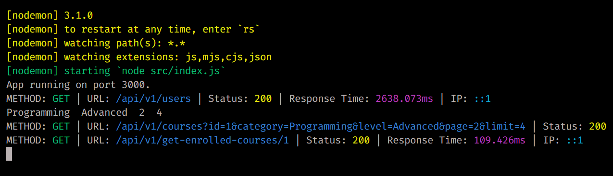

# NodeJS Backend Assessment

### NEON DB Connection

-   Initialization: The connectDB function initializes the database connection. It creates a connection pool utilizing the connection string retrieved from the environment variables.

-   Connection Pool: Utilizing a connection pool enables the reutilization of multiple connections, thereby enhancing efficiency and performance.

-   Error Handling: Error handling mechanisms are incorporated to log any connection errors to the console. If the connection fails, the process is terminated gracefully.

-   Export: The module exports the pool and connectDB functions, enabling other components of the application to access the database connection.



## Database Tables

-   **Course Table**

    -   Stores information about courses available on the platform.
    -   Columns:
        -   `id`: Auto-incrementing unique identifier for each course.
        -   `title`: Title of the course.
        -   `category`: Category of the course.
        -   `level`: Level of difficulty for the course.
        -   `description`: Description of the course.

-   **Enrollment Table**

    -   Tracks user enrollments in courses.
    -   Columns:
        -   `id`: Auto-incrementing unique identifier for each enrollment.
        -   `user_id`: Foreign key referencing the user enrolled in the course.
        -   `course_id`: Foreign key referencing the course the user is enrolled in.
        -   `enrollment_date`: Timestamp indicating when the enrollment was made.

-   **User Table**
    -   Stores information about users registered on the platform.
    -   Columns:
        -   `id`: Auto-incrementing unique identifier for each user.
        -   `name`: Name of the user.
        -   `email`: Email address of the user.
        -   `password`: Encrypted password of the user.
        -   `refresh_token`: Refresh token for JWT authentication.

```txt
PORT=3000
DATABASE_URL=

CLOUDINARY_CLOUD_NAME=
CLOUDINARY_API_KEY=
CLOUDINARY_API_SECRET=

ACCESS_TOKEN_SECRET=
REFRESH_TOKEN_SECRET=

RESEND_API_KEY=
```

```bash
    npm run dev
```



## Middleware

-   **Authentication Middleware**
    -   Handles user authentication using JWT tokens.
    -   Verifies the JWT token provided in the request headers.
    -   Fetches user details from the database based on the token.
    -   Sets the `req.user` object for authenticated routes.

## Controllers

-   **Course Controller**

    -   Manages CRUD operations for courses.
    -   Implements logic for fetching, creating, updating, and deleting courses.
    -   Handles requests related to courses from the client.

-   **User Controller**

    -   Manages user-related operations such as registration and profile management.
    -   Implements logic for user registration, fetching user profiles, and updating user profiles.
    -   Handles requests related to user management.

-   **Superadmin Controller**
    -   Manages operations accessible only to superadmin users.
    -   Implements logic for promoting users to superadmin status and managing courses.
    -   Handles requests for superadmin-specific actions.

## Routes

-   **User Routes**

    -   Define routes for user-related operations.
    -   Includes endpoints for user registration, profile fetching, and profile updating.
    -   Utilizes the authentication middleware for authentication.

-   **Superadmin Routes**

    -   Define routes for superadmin-specific actions.
    -   Includes endpoints for promoting users to superadmin status and managing courses.
    -   Utilizes the authentication middleware for superadmin authorization.

-   **Enrollment Routes**
    -   Define routes for managing course enrollments.
    -   Includes endpoints for fetching enrolled courses for users and enrolling users in courses.
